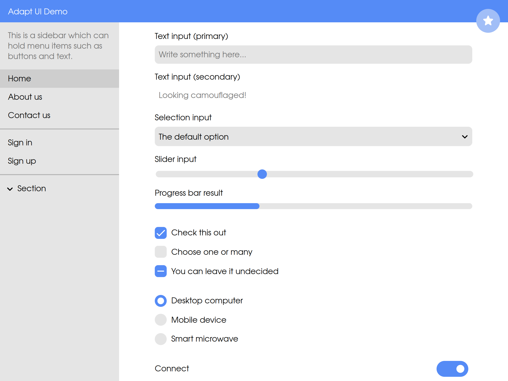

# Adapt UI

Adapt UI is LiveG's user interface library and design language for building consistent and appealing products. We use it as our official tool for building user interfaces here at LiveG, but since Adapt UI is open-source, everyone is welcome to use the library for developing their own stylish apps!

**[See a demo of Adapt UI in action](https://opensource.liveg.tech/Adapt-UI/demos/all)**

## Get started
We recommend using Adapt UI with Astronaut — our tool for building apps with just a few lines of JavaScript code. It's designed to enable all developers to create their own apps and services, whether they are beginners or advanced hackers.

**[Read our getting started guide for Astronaut and Adapt UI](astronaut-getting-started.md)**

If you'd rather stick to developing apps using HTML, CSS and JavaScript, that's fine, too! In fact, we sometimes use this non-Astronaut combo for some projects. We provide a jQuery-like interface for easily interacting with HTML elements from JavaScript, which also integrates many of Adapt UI's enhancements (like animation and localisation).

**[Read our getting started guide for Adapt UI](getting-started.md)**

## Develop further
Once you've learnt the basics, you can begin to build your own advanced apps with Adapt UI and Astronaut. You can look at the selection of — and get information on — Adapt UI components in our [component reference](reference/components/index.md).